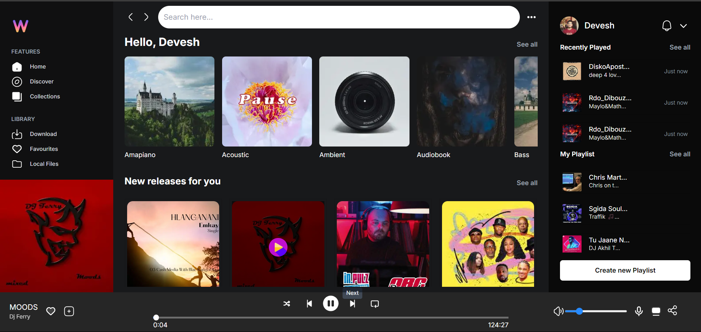
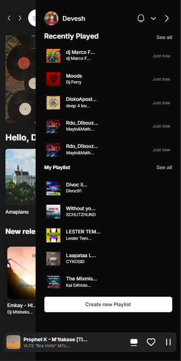

# Music Player Web App

This is a music player web application built using **Next.js** for the frontend, **Recoil** for state management, and various APIs to fetch and manage music data and images. The app allows users to play songs, manage playlists, view recently played tracks.

## Tech Stack

- **Next.js**: Used for building the frontend, utilizing server-side rendering for better performance.
- **Recoil**: Manages global state efficiently, especially for handling song data across components.
- **TypeScript**: Ensures type safety across the application.
- **Framer Motion**: To give animations in opening and closing of tabs.
- **Tailwind CSS**: For styling the UI with a utility-first approach.

## Images

Desktop View





Tablet View


Mobile View





## Features

- **Audio Playback**: Plays songs with controls for play/pause and volume.
- **Recently Played List**: Displays a list of recently played songs that updates in real-time.
- **Playlist Management**: Fetches and displays playlists using an external API.
- **Responsive Design**: Optimized for various screen sizes and devices.
- **Persistent Data**: Uses session storage to restore song data across page reloads.
- **Images API**: Used 2 API to get images based on the song, is there is no image for the song.
- **Swipe to know more feature for Mobile View**: Implemented an Interactive swipe to know more feature for the mobile view.

## Getting Started

To run this project locally:

```bash
git clone https://github.com/Codeforme1234/musicApp
cd musicApp
npm install
npm run dev
